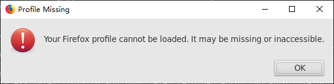

# 在Windows系统中安装`caffe`

本教程采用`WSL`安装`caffe`。

## `WSL`介绍

`WSL`即`Windows Subsystem Linux`，是Windows 10系统中的子系统，目前拥有较为全面的Linux功能，建议以后多多使用。以下主要讲一讲如何利用`WSL`使用`caffe`。

### 启用WSL功能

请查看[此链接](https://docs.microsoft.com/zh-cn/windows/wsl/install-win10)完成启用WSL功能。推荐使用Ubuntu系统。

启用WSL功能并安装`Ubuntu`之后，从应用中找到`Ubuntu`运行后会有进一步的安装，之后会要求设置`Ubuntu`用户和密码。完成这些设置后，就算彻底安装好Ubuntu子系统了。

### 安装caffe-cpu

进入Ubuntu子系统（即从应用中找到`Ubuntu`运行）后，推荐添加清华的镜像（加快下载速度）。参考[此链接](https://mirrors.tuna.tsinghua.edu.cn/help/ubuntu/)的说明，运行以下两行代码修改软件源配置文件：

```bash
sudo mv /etc/apt/sources.list /etc/apt/sources.list.bak
sudo nano /etc/apt/sources.list
```

后一句命令采用`nano`作为文本编辑器，需要粘贴（终端中鼠标右键记为粘贴）以下内容到其中，之后按`CTRL+X`，选择保存并退出。

```bash
# 默认注释了源码镜像以提高 apt update 速度，如有需要可自行取消注释
deb https://mirrors.tuna.tsinghua.edu.cn/ubuntu/ bionic main restricted universe multiverse
# deb-src https://mirrors.tuna.tsinghua.edu.cn/ubuntu/ bionic main restricted universe multiverse
deb https://mirrors.tuna.tsinghua.edu.cn/ubuntu/ bionic-updates main restricted universe multiverse
# deb-src https://mirrors.tuna.tsinghua.edu.cn/ubuntu/ bionic-updates main restricted universe multiverse
deb https://mirrors.tuna.tsinghua.edu.cn/ubuntu/ bionic-backports main restricted universe multiverse
# deb-src https://mirrors.tuna.tsinghua.edu.cn/ubuntu/ bionic-backports main restricted universe multiverse
deb https://mirrors.tuna.tsinghua.edu.cn/ubuntu/ bionic-security main restricted universe multiverse
# deb-src https://mirrors.tuna.tsinghua.edu.cn/ubuntu/ bionic-security main restricted universe multiverse

# 预发布软件源，不建议启用
# deb https://mirrors.tuna.tsinghua.edu.cn/ubuntu/ bionic-proposed main restricted universe multiverse
# deb-src https://mirrors.tuna.tsinghua.edu.cn/ubuntu/ bionic-proposed main restricted universe multiverse
```

配置好以上这些之后，在Ubuntu中执行以下命令完成已有软件的升级（其中有些软件的安装中需要在交互界面中确认信息，需要用键盘方向键选择`Yes`后按`Enter`确认）：

```bash
sudo apt update
sudo apt --assume-yes dist-upgrade
```

完成升级后，执行以下命令完成`pip3`、`caffe-cpu`的安装，以及一部分必须的`python`模块的安装。

```bash
sudo apt --assume-yes install python3-pip caffe-cpu firefox # 这一步将安装caffe和firefox（jupyter lab会用到）
echo "export DISPLAY=:0.0" >> .bashrc # 配置默认的图形界面端口（参见[准备图形界面服务]部分）
sudo pip3 install -i https://pypi.tuna.tsinghua.edu.cn/simple pip -U # 升级pip3
sudo pip3 config set global.index-url https://pypi.tuna.tsinghua.edu.cn/simple # 设置pip3镜像，加快速度
sudo pip3 install jupyterlab tensorflow scikit-learn numpy pandas nltk keras # 可能还有一些包需要安装
sudo pip3 install --upgrade scikit-image # 这一步更新为了校正一些错误。
```

以上命令执行完之后，关闭Ubuntu，并重新打开Ubuntu即可完成安装。

### 准备图形界面服务

这一步是为了`jupyter lab`可以正常打开`firefox`浏览器。推荐安装`Xming`作为该服务软件，下载地址如下：

https://sourceforge.net/projects/xming/files/latest/download

下载完成并安装后，打开`Xming`即可，不会弹出任何窗口。

## 完成后测试

以上就算是全部完成安装了。之后打开`Ubuntu`，需要知道的是`Windows`系统的文件放在目录`/mnt`里面，其中包含了所有分区中的文件，先`cd`到工作坊的代码所在目录，并执行

```bash
jupyter lab
```

就大功告成了！:)

## FAQ

### 为什么使用`jupyter lab`后，没有成功弹出`firefox`浏览器？

如果弹出的窗口如下：



请在Ubuntu的终端中执行以下命令：

```bash
sudo chown -R $USER:$USER ~/.cache
```
